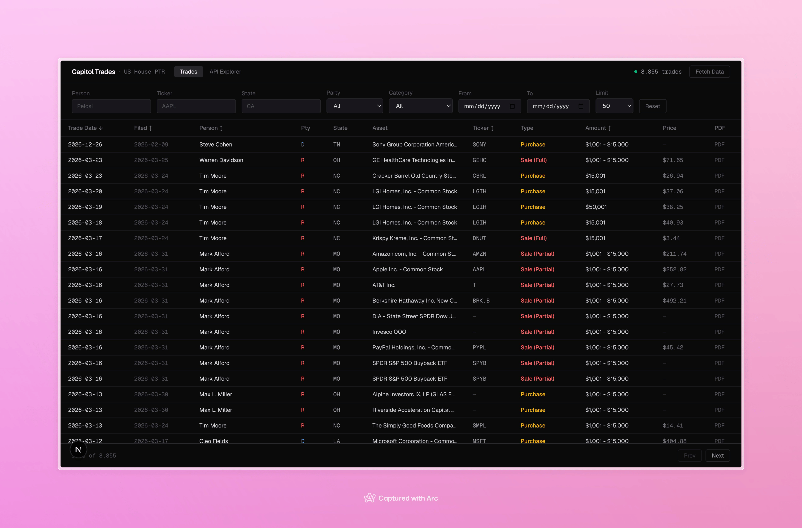

# Capitol API

The first free, open source, and self-hostable API to explore Congressional trades.

Parses and serves US House of Representatives financial disclosure data (Periodic Transaction Reports, 2018–2026).

On first startup with an empty cache, the server immediately begins fetching and parsing all PTR filings for the configured year range. Trades are saved incrementally so the server is queryable as data streams in. A restart will resume from where it left off.



(*This image is from the [sister project](https://github.com/crnicholson/capitol-api-frontend) meant to display the information from the API.*)

---

## Warning

This API is not meant to provide financial advice and please do not make any financial decisions off it. Please use at your own risk and understand, although infrequent, it can miss trades or provide incorrect information

---

## Quickstart

```bash
git clone https://github.com/crnicholson/capitol-api.git 
cd capitol-api
npm install
npm start
```

The API starts on `http://localhost:3000` by default.

Verify it is running:

```bash
curl -s http://localhost:3000/api/status | python3 -m json.tool
```

Or get 25 most recent trades:

```bash
curl -s "http://localhost:3000/api/trades?recent=25" | python3 -m json.tool
```

---

## Configuration (`.env`)

These are the default settings out-of-the-box.

| Variable | Default | Description |
|---|---|---|
| `PORT` | `3000` | HTTP port |
| `YEARS_START` | `2025` | First year to fetch |
| `YEARS_END` | `2026` | Last year to fetch |
| `CACHE_REFRESH_HOURS` | `0` | Hours between auto-refresh. `0` = never (only fetch if cache is empty on startup) |
| `FETCH_DELAY_MS` | `500` | Delay between PDF downloads (ms) |
| `PRICE_CONCURRENCY` | `3` | Parallel price lookups |

---

## Trade Object Schema

```json
{
  "id": "20011070-1",
  "owner": "DC", // DC = dependent child, SP = spouse, JT = joint
  "asset": {
    "name": "Amazon.com, Inc.",
    "ticker": "AMZN",
    "type": "ST",
    "typeDescription": "Stocks (including ADRs)"
  },
  "transaction": {
    "type": "P",
    "description": "Purchase",
    "category": "buy",
    "tradeDate": "2019-01-02",
    "notificationDate": "2019-01-02",
    "filingDate": "2019-01-15",
    "amount": "$1,001 - $15,000",
    "amountMin": 1001,
    "amountMax": 15000,
    "capitalGains": false,
    "price": 1629.51
  },
  "filing": {
    "docId": "20011070",
    "year": 2019,
    "pdfUrl": "https://disclosures-clerk.house.gov/public_disc/ptr-pdfs/2019/20011070.pdf"
  },
  "person": {
    "bioguideId": "A000367",
    "name": "Justin Amash",
    "firstName": "Justin",
    "lastName": "Amash",
    "state": "MI",
    "district": 3,
    "party": "Republican",
    "phone": "202-225-3831",
    "gender": "M",
    "birthday": "1980-04-18",
    "terms": [ ... ]
  }
}
```

> **Note:** `tradeDate` is when the trade was executed. `notificationDate` is when the member was notified. `filingDate` is when the report was submitted to the Clerk — these are all distinct and should not be conflated.

---

## API Reference

### `GET /api/status`

Returns cache state and current fetch progress.

```bash
curl -s http://localhost:3000/api/status | python3 -m json.tool
```

---

### `POST /api/refresh`

Incrementally fetch new PTR filings. Already-cached filings are skipped — only filings not yet in the cache are downloaded and parsed. Runs in the background.

```bash
curl -s -X POST http://localhost:3000/api/refresh | python3 -m json.tool
```

---

### `POST /api/refresh/full`

Wipe the entire cache and re-fetch all PTR filings from scratch. Use this to rebuild after a corrupt cache or to pick up corrected historical data. Runs in the background.

```bash
curl -s -X POST http://localhost:3000/api/refresh/full | python3 -m json.tool
```

---

### `GET /api/trades`

Main query endpoint. All parameters are optional and combinable.

#### Filter Parameters

| Param | Example | Description |
|---|---|---|
| `state` | `state=CA` | 2-letter state code |
| `party` | `party=Democrat` | Party (partial match) |
| `person` | `person=Pelosi` | Name (partial match) |
| `ticker` | `ticker=AAPL` | Exact ticker symbol |
| `assetType` | `assetType=ST` | Asset type code (`ST`, `CT`, `MF`, `EF`, etc.) |
| `type` | `type=P` | Transaction type code (`P`, `S`, `E`, etc.) |
| `category` | `category=sell` | Trade category (`buy`, `sell`, `exchange`, `gift`, etc.) |
| `from` | `from=2025-01-01` | Trade date lower bound (ISO format) |
| `to` | `to=2025-12-31` | Trade date upper bound (ISO format) |

#### Sort Parameters

| Param | Values | Default |
|---|---|---|
| `sort` | `date` \| `oldest` \| `newest` \| `amount` \| `largest` \| `name` \| `ticker` \| `filingdate` | `date` (newest first) |
| `order` | `asc` \| `desc` | `desc` |

#### Pagination

| Param | Example | Description |
|---|---|---|
| `limit` | `limit=50` | Max results to return |
| `offset` | `offset=100` | Skip N results |
| `recent` | `recent=25` | Return N most recently *filed* trades (overrides sort/pagination) |

---

### `GET /api/trades/download`

Same as `/api/trades` but returns a `Content-Disposition: attachment` header so browsers download it as `trades.json`. Accepts the same query parameters.

---

## Example Curl Commands

```bash
# Check status
curl -s http://localhost:3000/api/status | python3 -m json.tool

# All trades (first page of 20)
curl -s "http://localhost:3000/api/trades?limit=20" | python3 -m json.tool

# 25 most recently filed trades
curl -s "http://localhost:3000/api/trades?recent=25" | python3 -m json.tool

# All purchases sorted by largest amount first
curl -s "http://localhost:3000/api/trades?type=P&sort=largest" | python3 -m json.tool

# All Apple trades
curl -s "http://localhost:3000/api/trades?ticker=AAPL" | python3 -m json.tool

# All sells by California Democrats
curl -s "http://localhost:3000/api/trades?state=CA&party=Democrat&category=sell" | python3 -m json.tool

# Trades by a specific person
curl -s "http://localhost:3000/api/trades?person=Pelosi" | python3 -m json.tool

# Trades in a date range, sorted oldest first
curl -s "http://localhost:3000/api/trades?from=2025-01-01&to=2025-06-30&sort=oldest" | python3 -m json.tool

# All Republican buys with pagination
curl -s "http://localhost:3000/api/trades?party=Republican&category=buy&limit=50&offset=0" | python3 -m json.tool

# Download all California trades as a JSON file
curl -s "http://localhost:3000/api/trades/download?state=CA" -o ca_trades.json

# All trades sorted alphabetically by person name
curl -s "http://localhost:3000/api/trades?sort=name&order=asc&limit=100" | python3 -m json.tool

# Top 10 largest individual trades
curl -s "http://localhost:3000/api/trades?sort=largest&limit=10" | python3 -m json.tool

# All stock trades (asset type ST)
curl -s "http://localhost:3000/api/trades?assetType=ST" | python3 -m json.tool

# All cryptocurrency trades
curl -s "http://localhost:3000/api/trades?assetType=CT" | python3 -m json.tool

# All ETF purchases
curl -s "http://localhost:3000/api/trades?assetType=EF&category=buy" | python3 -m json.tool

# Incrementally fetch only new filings
curl -s -X POST http://localhost:3000/api/refresh | python3 -m json.tool

# Full wipe and re-fetch everything
curl -s -X POST http://localhost:3000/api/refresh/full | python3 -m json.tool
```

---

## Transaction Action Codes

Transaction action codes describe what happened in the transaction (buy, sell, gift, etc.).
They are different from asset type codes, which describe what the asset *is* (`ST`, `EF`, `MF`, etc.).

### Codes Currently Parsed By This API

| Code | Description | Category |
|---|---|---|
| `P` | Purchase | buy |
| `S` | Sale (Full) | sell |
| `S (partial)` | Sale (Partial) | sell |
| `E` | Exchange | exchange |
| `G` | Gift | gift |
| `M` | Merger / Acquisition | corporate_action |
| `C` | Conversion | corporate_action |
| `T` | Transfer | transfer |
| `D` | Dividend Reinvestment | dividend |
| `W` | Will / Inheritance / Trust Distribution | inheritance |
| `HS` | Hard Sale | sell |
| `HE` | Hard Exchange | exchange |
| `HP` | Hard Purchase | buy |
| `O` | Other | other |

---

## Asset Type Codes

Asset type codes describe what the asset *is*. Use these with the `assetType` filter parameter.

| Code | Description |
|---|---|
| `ST` | Stocks (including ADRs) |
| `CT` | Cryptocurrency |
| `EF` | Exchange Traded Funds (ETF) |
| `MF` | Mutual Funds |
| `CS` | Corporate Securities (Bonds and Notes) |
| `GS` | Government Securities and Agency Debt |
| `OP` | Options |
| `FU` | Futures |
| `RE` | Real Estate Invest. Trust (REIT) |
| `RS` | Restricted Stock Units (RSUs) |
| `PS` | Stock (Not Publicly Traded) |
| `IR` | IRA |
| `OT` | Other |

For the full list of asset type codes, see [tradetypes.csv](tradetypes.csv).

---

## Data Sources

- **Filings index:** `https://disclosures-clerk.house.gov/public_disc/financial-pdfs/{year}FD.zip`
- **PTR PDFs:** `https://disclosures-clerk.house.gov/public_disc/ptr-pdfs/{year}/{docId}.pdf`
- **Legislators (current):** `https://unitedstates.github.io/congress-legislators/legislators-current.json`
- **Legislators (historical):** `https://unitedstates.github.io/congress-legislators/legislators-historical.json`
- **Stock prices:** Yahoo Finance chart API (via direct HTTP)
